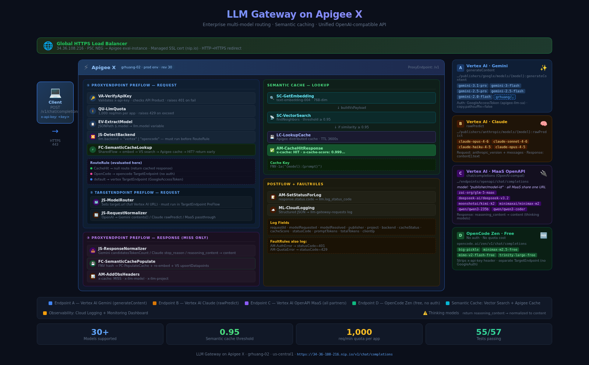

# LLM Gateway on Apigee X

[](LICENSE)
[](https://cloud.google.com/apigee)
[](https://cloud.google.com/vertex-ai)
[](https://platform.openai.com/docs/api-reference)
[](ui/)
[](tests/run-tests.sh)

An enterprise-grade LLM API gateway built on **Google Cloud Apigee X**, providing a unified
OpenAI-compatible interface to 30+ models across four backend types.

## Features

| Feature | Details |
|---------|---------|
| **Unified API** | Single `POST /v1/chat/completions` endpoint, OpenAI-compatible |
| **Multi-model routing** | Gemini 2.0/2.5/3.x (incl. image), Claude 4.x, GLM, DeepSeek, Kimi, MiniMax, Qwen |
| **Free model tier** | 7 OpenCode Zen free models (`opencode/*`), no token cost |
| **Cross-project routing** | Quota isolation across GCP projects (`PROJECT_ID/CROSS_PROJECT_ID`) |
| **Semantic caching** | Vertex AI Vector Search (768-dim) + Apigee distributed cache, ~0.95 similarity |
| **API key authentication** | Apigee native API Products + VerifyAPIKey, 1000 req/min quota |
| **Token quota** | App/product-level token quota with model weight coefficients |
| **Streaming** | `"stream":true` → SSE passthrough for all backends |
| **Image generation** | Gemini image models → OpenAI content array with `image_url` data URLs |
| **Error transparency** | `error.source: "gateway"` vs `"model"` on every error |
| **Observability** | Structured Cloud Logging, log-based metrics, Monitoring dashboard, 3 alerts |
| **Admin UI** | Next.js 15 control console, IAP-protected Cloud Run |
| **Test suite** | 75 automated tests across 15 sections |

---

## Architecture

> **Interactive diagram:** open [`docs/architecture.html`](docs/architecture.html) in any browser.



```
Client (POST /v1/chat/completions, x-api-key: <key>)
           │
           ▼
  Global HTTPS Load Balancer (static IP, managed SSL cert)
           │
           ▼ PSC NEG → Apigee eval-instance
┌─────────────────────────────────────────────────────────────────┐
│                  Apigee X (YOUR_PROJECT_ID, prod env)           │
│                                                                 │
│  ProxyEndpoint PreFlow (REQUEST)                                │
│  ① VA-VerifyApiKey      API key validation, product quota       │
│  ② QU-LlmQuota          1000 req/min per app                    │
│  ③ EV-ExtractModel      $.model from request body               │
│  ④ JS-DetectBackend     llm.backend = "vertex" | "opencode"    │
│  ⑤ FC-SemanticCacheLookup                                       │
│     ├─ SC-GetEmbedding      → text-embedding-004 (768-dim)     │
│     ├─ SC-VectorSearch      → similarity ≥ 0.95?               │
│     ├─ LC-LookupCache       → Apigee distributed cache         │
│     └─ AM-CacheHitResponse  → return cached (x-cache: HIT)     │
│                                                                 │
│  RouteRule: CacheHit → null | OpenCode → opencode | → vertex   │
│                                                                 │
│  TargetEndpoint PreFlow (REQUEST)                               │
│  ⑥ JS-ModelRouter       → set target.url + routing metadata    │
│  ⑦ JS-RequestNormalizer → OpenAI → Gemini/Claude/MaaS format   │
│                                                                 │
│  ProxyEndpoint PreFlow (RESPONSE, cache MISS only)              │
│  ⑧  JS-ResponseNormalizer  → all backends → OpenAI format      │
│  ⑨  JS-ComputeEffectiveTokens + Q-TokenQuotaCounter            │
│  ⑩  FC-SemanticCachePopulate → store response + upsert vector  │
│  ⑪  AM-AddObsHeaders   → x-cache, x-cache-score, x-llm-model  │
│                                                                 │
│  PostFlow: ML-CloudLogging → structured JSON → Cloud Logging   │
│  FaultRules: AM-AuthError / AM-QuotaError (with logging)       │
└─────────────────────────────────────────────────────────────────┘
           │
  A. Vertex AI generateContent  (Gemini)
  B. Vertex AI rawPredict       (Claude)
  C. Vertex AI OpenAPI endpoint (all MaaS partner models)
  D. OpenCode Zen               (free, no auth)
```

---

## Supported Models

### Google Gemini — Endpoint A (generateContent)
| Model | Notes |
|-------|-------|
| `gemini-3.1-pro-preview` | thinking |
| `gemini-3.1-flash-lite-preview` | thinking |
| `gemini-3.1-flash-image-preview` | image generation |
| `gemini-3-pro-preview` | thinking |
| `gemini-3-flash-preview` | thinking |
| `gemini-2.5-pro` | thinking |
| `gemini-2.5-flash` | thinking, **default fallback** |
| `gemini-2.5-flash-lite` | non-thinking, recommended baseline |
| `gemini-2.5-flash-image` | image generation |
| `YOUR_CROSS_PROJECT_ID/gemini-2.5-pro` | cross-project quota isolation |

> 🪦 **Gemini 2.0 series retired by Google (2026-04)** — `gemini-2.0-flash`, `gemini-2.0-flash-001`, `gemini-2.0-flash-lite` all return 404. The router falls these requests through to `gemini-2.5-flash`.
>
> Gemini 3.x/2.5 thinking models: thinking tokens count against `maxOutputTokens`.
> With small `max_tokens`, thinking may exhaust the budget → empty response.
> Set `max_tokens ≥ 200` for thinking models.

### Anthropic Claude — Endpoint B (rawPredict)
`claude-opus-4-7` · `claude-opus-4-6` · `claude-sonnet-4-6` · `claude-haiku-4-5` · `claude-opus-4-5` · `claude-sonnet-4-5` · `claude-opus-4` · `claude-opus-4-1`

> ⚠️ Anthropic deprecated `temperature` for Claude 4.7 — sending it returns 400. Use `top_p` or omit.

### MaaS Partner Models — Endpoint C (Vertex AI OpenAPI)
| Model alias | Backend | Provider |
|-------------|---------|----------|
| `glm-4.7` | `zai-org/glm-4.7-maas` | ZhipuAI |
| `glm-5` | `zai-org/glm-5-maas` | ZhipuAI (thinking) |
| `deepseek-v3.2` | `deepseek-ai/deepseek-v3.2-maas` | DeepSeek |
| `deepseek-ocr` | `deepseek-ai/deepseek-ocr-maas` | DeepSeek |
| `kimi-k2-thinking` | `moonshotai/kimi-k2-thinking-maas` | Moonshot (thinking) |
| `minimax-m2` | `minimaxai/minimax-m2-maas` | MiniMax (thinking) |
| `qwen3-235b` | `qwen/qwen3-235b-a22b-instruct-2507-maas` | Alibaba |
| `qwen3-next-80b` | `qwen/qwen3-next-80b-a3b-instruct-maas` | Alibaba |
| `qwen3-next-80b-think` | `qwen/qwen3-next-80b-a3b-thinking-maas` | Alibaba (thinking) |
| `qwen3-coder` | `qwen/qwen3-coder-480b-a35b-instruct-maas` | Alibaba |
| `grok-4.20-reasoning` / `grok` | `xai/grok-4.20-reasoning` | xAI (reasoning) |
| `grok-4` / `grok-4-fast` / `grok-3` / `grok-3-mini` / `grok-code-fast-1` | `xai/<model>` | xAI — requires Model Garden enablement |

> Grok publisher is `xai` (NOT `x-ai`). Reasoning models need `max_tokens ≥ 300` for visible content.

### OpenCode Zen — Endpoint D (free, no auth)
`opencode/big-pickle` · `opencode/minimax-m2.5-free` · `opencode/hy3-preview-free` · `opencode/ling-2.6-flash-free` · `opencode/gpt-5-nano` · `opencode/nemotron-3-super-free`

> Free model lineup churns frequently. Verify the live list at `https://opencode.ai/zen/v1/models` before deploying. As of 2026-04-23, the `mimo-v2-*` and `trinity-large-preview-free` models have been retired upstream.

---

## Quick API Reference

```bash
# Load environment (after deploying)
source infra/api-key.env   # sets API_KEY
source infra/apigee.env    # sets APIGEE_HOST
HOST="https://$APIGEE_HOST"

# Health check
curl -sk $HOST/v1/health

# Gemini 2.5 Flash
curl -sk -X POST $HOST/v1/chat/completions \
  -H "x-api-key: $API_KEY" -H "Content-Type: application/json" \
  -d '{"model":"gemini-2.5-flash","messages":[{"role":"user","content":"Hello!"}],"max_tokens":100}'

# Claude Sonnet 4.6
curl -sk -X POST $HOST/v1/chat/completions \
  -H "x-api-key: $API_KEY" -H "Content-Type: application/json" \
  -d '{"model":"claude-sonnet-4-6","messages":[{"role":"user","content":"Hello!"}],"max_tokens":100}'

# GLM-5 (MaaS)
curl -sk -X POST $HOST/v1/chat/completions \
  -H "x-api-key: $API_KEY" -H "Content-Type: application/json" \
  -d '{"model":"glm-5","messages":[{"role":"user","content":"Hello!"}],"max_tokens":100}'

# Free model ($0 cost)
curl -sk -X POST $HOST/v1/chat/completions \
  -H "x-api-key: $API_KEY" -H "Content-Type: application/json" \
  -d '{"model":"opencode/big-pickle","messages":[{"role":"user","content":"Hello!"}],"max_tokens":100}'

# Streaming (any model)
curl -sk -X POST $HOST/v1/chat/completions \
  -H "x-api-key: $API_KEY" -H "Content-Type: application/json" \
  -d '{"model":"gemini-2.5-flash","messages":[{"role":"user","content":"Count 1 to 5"}],"max_tokens":100,"stream":true}'

# Cross-project routing
curl -sk -X POST $HOST/v1/chat/completions \
  -H "x-api-key: $API_KEY" -H "Content-Type: application/json" \
  -d '{"model":"YOUR_CROSS_PROJECT_ID/gemini-2.5-pro","messages":[{"role":"user","content":"Hi"}],"max_tokens":50}'
```

### Response format
```json
{
  "id": "chatcmpl-...",
  "object": "chat.completion",
  "model": "gemini-2.5-flash",
  "choices": [{"index":0,"message":{"role":"assistant","content":"Hello!"},"finish_reason":"stop"}],
  "usage": {"prompt_tokens":8,"completion_tokens":12,"total_tokens":20}
}
```

### Response headers
```
x-cache: HIT | MISS
x-cache-score: 0.9999979   # cosine similarity (HIT only)
x-llm-model: gemini-2.5-flash
x-llm-project: YOUR_PROJECT_ID
```
> Streaming (`stream:true`) skips cache lookup/populate and all response-side headers — pure SSE passthrough.

### Error taxonomy
| `error.source` | `error.code` | Meaning |
|----------------|--------------|---------|
| `gateway` | `invalid_api_key` | Bad or missing API key |
| `gateway` | `rate_limit_exceeded` | Apigee req/min quota (retry after 60s) |
| `gateway` | `token_quota_exceeded` | Apigee token quota (retry after 3600s) |
| `model` | `upstream_rate_limit` | Backend 429 — model's own quota |
| `model` | `upstream_error` | Other backend 4xx/5xx |

---

## Deploy Your Own

### Prerequisites

- GCP project with billing enabled
- `gcloud` CLI installed and authenticated (`gcloud auth login`)
- `python3` (for bundle packaging and polling scripts)
- Docker (for Admin UI only)
- Permissions: Project Owner or custom role with Apigee, Compute, Vertex AI, IAM admin

> **Enable required APIs first** (see Phase 1.1).

### Step 0 — Clone and configure

```bash
git clone https://github.com/YOUR_GITHUB_USER/llm-apigee.git
cd llm-apigee

# 1. Copy and fill in your environment config
cp infra/apigee.env.example infra/apigee.env
# Edit infra/apigee.env — fill in PROJECT_ID, REGION, and VS IDs after Phase 1

# 2. After completing Phase 1 (infra provisioned), run configure.sh once:
#    This substitutes YOUR_* placeholders in Apigee XML/JS with your real values.
source infra/apigee.env && bash infra/configure.sh
```

`infra/configure.sh` patches these files in-place (uses `sed`; revert with `git checkout -- apigee/`):
- `apigee/sharedflows/SemanticCache-Lookup/*/SC-GetEmbedding.xml`
- `apigee/sharedflows/SemanticCache-Lookup/*/SC-VectorSearch.xml`
- `apigee/sharedflows/SemanticCache-Populate/*/SC-GetEmbeddingPopulate.xml`
- `apigee/sharedflows/SemanticCache-Populate/*/SC-UpsertVector.xml`
- `apigee/proxies/llm-gateway/apiproxy/policies/ML-CloudLogging.xml`
- `apigee/proxies/llm-gateway/apiproxy/resources/jsc/model-router.js`

---

### Phase 1 — Infrastructure

#### 1.1 Enable required APIs

```bash
source infra/apigee.env
bash infra/01-enable-apis.sh
# Enables: apigee, aiplatform, compute, servicenetworking, logging, monitoring, etc.
```

Or manually:
```bash
gcloud services enable \
  apigee.googleapis.com \
  apigeeconnect.googleapis.com \
  aiplatform.googleapis.com \
  compute.googleapis.com \
  servicenetworking.googleapis.com \
  cloudresourcemanager.googleapis.com \
  logging.googleapis.com \
  monitoring.googleapis.com \
  secretmanager.googleapis.com \
  --project=$PROJECT_ID
```

#### 1.2 Create Apigee VPC

Apigee X requires a dedicated VPC with a `/22` subnet.

```bash
# VPC
gcloud compute networks create apigee-vpc \
  --project=$PROJECT_ID \
  --subnet-mode=custom \
  --bgp-routing-mode=regional

# /22 subnet in us-central1
gcloud compute networks subnets create apigee-subnet \
  --project=$PROJECT_ID \
  --network=apigee-vpc \
  --region=us-central1 \
  --range=10.0.0.0/22
```

#### 1.3 Configure VPC peering for Apigee service networking

```bash
# Allocate IP range for peering
gcloud compute addresses create apigee-peering-range \
  --project=$PROJECT_ID \
  --network=apigee-vpc \
  --global \
  --purpose=VPC_PEERING \
  --prefix-length=16

# Connect service networking
gcloud services vpc-peerings connect \
  --project=$PROJECT_ID \
  --network=apigee-vpc \
  --ranges=apigee-peering-range \
  --service=servicenetworking.googleapis.com
```

#### 1.4 Provision Apigee X organization *(takes 20–30 min)*

```bash
source infra/apigee.env
bash infra/02-provision-apigee.sh
# Starts async provisioning; use poll-apigee-provision.sh to monitor
```

Or manually:
```bash
gcloud alpha apigee organizations provision \
  --project=$PROJECT_ID \
  --authorized-network=apigee-vpc \
  --runtime-location=us-central1 \
  --analytics-region=us-central1 \
  --async

# Poll progress (replace <OP_ID> with the returned operation ID)
OP_ID="<OP_ID>"
bash infra/poll-apigee-provision.sh "$OP_ID"
```

#### 1.5 Create environment, environment group, and attach instance

```bash
source infra/apigee.env
bash infra/05-create-environment.sh
```

This script:
1. Creates the `prod` environment
2. Reserves a static external IP → `APIGEE_IP`, derives `APIGEE_HOST` (`${IP//./-}.nip.io`)
3. Creates environment group `llm-gateway-envgroup` with that hostname
4. Attaches `prod` to the group
5. Attaches the Apigee eval-instance to `prod`

> `nip.io` provides wildcard DNS for IP addresses — no real domain needed.

After this step, update `infra/apigee.env` with `APIGEE_IP` and `APIGEE_HOST`.

#### 1.6 Set up Global HTTPS Load Balancer

```bash
source infra/apigee.env
bash infra/06-setup-load-balancer.sh
```

This creates:
- PSC Network Endpoint Group (LB → Apigee private service connect)
- Backend service + URL map
- Google-managed SSL certificate for `$APIGEE_HOST` (auto-provisioned; ~10–15 min after first HTTPS request)
- HTTPS forwarding rule (port 443) + HTTP redirect (port 80)

> **SSL cert provisioning:** The cert enters `PROVISIONING` state and becomes `ACTIVE` only after the first real HTTPS request reaches the LB. This can take 10–15 min. Monitor with:
> ```bash
> gcloud compute ssl-certificates describe apigee-managed-cert --global --format='value(managed.status)'
> ```

#### 1.7 Create Vertex AI Vector Search index and endpoint *(takes 15–20 min)*

```bash
TOKEN=$(gcloud auth print-access-token)
VS_REGION=us-central1

# 1. Create streaming index (768-dim, DOT_PRODUCT_DISTANCE)
OP=$(curl -s -X POST \
  "https://${VS_REGION}-aiplatform.googleapis.com/v1/projects/$PROJECT_ID/locations/$VS_REGION/indexes" \
  -H "Authorization: Bearer $TOKEN" -H "Content-Type: application/json" \
  -d '{
    "displayName": "llm-semantic-cache-index",
    "metadata": {
      "config": {
        "dimensions": 768,
        "approximateNeighborsCount": 10,
        "distanceMeasureType": "DOT_PRODUCT_DISTANCE",
        "algorithmConfig": {
          "treeAhConfig": {"leafNodeEmbeddingCount": 500, "leafNodesToSearchPercent": 7}
        }
      }
    },
    "indexUpdateMethod": "STREAM_UPDATE"
  }')
INDEX_ID=$(echo $OP | python3 -c "import sys,json; print(json.load(sys.stdin)['name'].split('/')[5])")
OP_NAME=$(echo $OP  | python3 -c "import sys,json; print(json.load(sys.stdin)['name'])")
echo "Index ID: $INDEX_ID"

# Poll until index creation finishes (~5 min)
while true; do
  DONE=$(curl -s "${OP_NAME}" -H "Authorization: Bearer $(gcloud auth print-access-token)" \
    | python3 -c "import sys,json; print(json.load(sys.stdin).get('done',False))")
  echo "$(date +%H:%M:%S) Index done: $DONE"
  [ "$DONE" = "True" ] && break; sleep 30
done

# 2. Create public IndexEndpoint
EP_OP=$(curl -s -X POST \
  "https://${VS_REGION}-aiplatform.googleapis.com/v1/projects/$PROJECT_ID/locations/$VS_REGION/indexEndpoints" \
  -H "Authorization: Bearer $TOKEN" -H "Content-Type: application/json" \
  -d '{"displayName":"llm-semantic-cache-endpoint","publicEndpointEnabled":true}')
EP_ID=$(echo $EP_OP | python3 -c "import sys,json; print(json.load(sys.stdin)['name'].split('/')[5])")
EP_OP_NAME=$(echo $EP_OP | python3 -c "import sys,json; print(json.load(sys.stdin)['name'])")
echo "Endpoint ID: $EP_ID"

# Poll until endpoint ready (~1 min)
while true; do
  DONE=$(curl -s "${EP_OP_NAME}" -H "Authorization: Bearer $(gcloud auth print-access-token)" \
    | python3 -c "import sys,json; print(json.load(sys.stdin).get('done',False))")
  [ "$DONE" = "True" ] && break; sleep 15
done

# 3. Deploy index to endpoint (automaticResources, ~15 min)
DEPLOY_OP=$(curl -s -X POST \
  "https://${VS_REGION}-aiplatform.googleapis.com/v1/projects/$PROJECT_ID/locations/$VS_REGION/indexEndpoints/$EP_ID:deployIndex" \
  -H "Authorization: Bearer $TOKEN" -H "Content-Type: application/json" \
  -d "{
    \"deployedIndex\": {
      \"id\": \"llm_semantic_cache\",
      \"index\": \"projects/$PROJECT_ID/locations/$VS_REGION/indexes/$INDEX_ID\",
      \"displayName\": \"llm-semantic-cache\",
      \"automaticResources\": {\"minReplicaCount\": 1, \"maxReplicaCount\": 2}
    }
  }")
DEPLOY_OP_NAME=$(echo $DEPLOY_OP | python3 -c "import sys,json; print(json.load(sys.stdin)['name'])")
echo "Deploy operation: $DEPLOY_OP_NAME"

# Poll deployment (~15 min)
while true; do
  DONE=$(curl -s "https://${VS_REGION}-aiplatform.googleapis.com/v1/${DEPLOY_OP_NAME}" \
    -H "Authorization: Bearer $(gcloud auth print-access-token)" \
    | python3 -c "import sys,json; print(json.load(sys.stdin).get('done',False))")
  echo "$(date +%H:%M:%S) Deploy done: $DONE"
  [ "$DONE" = "True" ] && break; sleep 60
done

# 4. Get public endpoint domain
VS_DOMAIN=$(curl -s \
  "https://${VS_REGION}-aiplatform.googleapis.com/v1/projects/$PROJECT_ID/locations/$VS_REGION/indexEndpoints/$EP_ID" \
  -H "Authorization: Bearer $TOKEN" \
  | python3 -c "import sys,json; print(json.load(sys.stdin)['publicEndpointDomainName'])")
echo "VS Endpoint domain: $VS_DOMAIN"
```

**Save all IDs to `infra/apigee.env`:**
```bash
cat >> infra/apigee.env << EOF
VECTOR_SEARCH_INDEX_ID=$INDEX_ID
VECTOR_SEARCH_ENDPOINT_ID=$EP_ID
VECTOR_SEARCH_DEPLOYED_INDEX_ID=llm_semantic_cache
VECTOR_SEARCH_ENDPOINT_DOMAIN=$VS_DOMAIN
EOF
```

#### 1.8 Run configure.sh to inject your IDs

Now that all infrastructure IDs are known, run the configure script once:
```bash
source infra/apigee.env && bash infra/configure.sh
```

Expected output:
```
Configuring for:
  PROJECT_ID     = your-project-id
  PROJECT_NUMBER = 123456789012
  VS_INDEX_ID    = 1234567890123456789
  VS_ENDPOINT_ID = 9876543210987654321
  VS_ENDPOINT    = xxxxxxx.us-central1-123456789012.vdb.vertexai.goog

  configured: apigee/sharedflows/SemanticCache-Lookup/.../SC-GetEmbedding.xml
  configured: apigee/sharedflows/SemanticCache-Lookup/.../SC-VectorSearch.xml
  configured: apigee/sharedflows/SemanticCache-Populate/.../SC-GetEmbeddingPopulate.xml
  configured: apigee/sharedflows/SemanticCache-Populate/.../SC-UpsertVector.xml
  configured: apigee/proxies/llm-gateway/apiproxy/policies/ML-CloudLogging.xml
  configured: apigee/proxies/llm-gateway/apiproxy/resources/jsc/model-router.js
Done.
```

---

### Phase 2 — API Key Authentication & Model Routing

#### 2.1 Create Apigee service account with required IAM roles

```bash
source infra/apigee.env
SA_EMAIL="apigee-llm-sa@$PROJECT_ID.iam.gserviceaccount.com"
PROJECT_NUMBER=$(gcloud projects describe $PROJECT_ID --format='value(projectNumber)')

# Create SA
gcloud iam service-accounts create apigee-llm-sa \
  --project=$PROJECT_ID \
  --display-name="Apigee LLM Gateway SA"

# Vertex AI access (Gemini, Claude, MaaS)
gcloud projects add-iam-policy-binding $PROJECT_ID \
  --member="serviceAccount:$SA_EMAIL" \
  --role="roles/aiplatform.user" --condition=None

# Cloud Logging write
gcloud projects add-iam-policy-binding $PROJECT_ID \
  --member="serviceAccount:$SA_EMAIL" \
  --role="roles/logging.logWriter" --condition=None

# Allow Apigee Service Agent to impersonate this SA
# (required for Authentication.GoogleAccessToken in TargetEndpoint)
gcloud iam service-accounts add-iam-policy-binding $SA_EMAIL \
  --project=$PROJECT_ID \
  --member="serviceAccount:service-${PROJECT_NUMBER}@gcp-sa-apigee.iam.gserviceaccount.com" \
  --role="roles/iam.serviceAccountTokenCreator"

# Optional: cross-project quota isolation
# gcloud projects add-iam-policy-binding YOUR_CROSS_PROJECT_ID \
#   --member="serviceAccount:$SA_EMAIL" \
#   --role="roles/aiplatform.user" --condition=None
```

#### 2.2 Create API Product, Developer, and App — extract API key

```bash
source infra/apigee.env
TOKEN=$(gcloud auth print-access-token)
ORG=$APIGEE_ORG

# API Product: 1000 req/min quota
curl -s -X POST "https://apigee.googleapis.com/v1/organizations/$ORG/apiproducts" \
  -H "Authorization: Bearer $TOKEN" -H "Content-Type: application/json" \
  -d '{
    "name": "llm-gateway-product",
    "displayName": "LLM Gateway API Product",
    "approvalType": "auto",
    "environments": ["prod"],
    "proxies": ["llm-gateway"],
    "quota": "1000",
    "quotaInterval": "1",
    "quotaTimeUnit": "minute",
    "attributes": [
      {"name": "access", "value": "public"},
      {"name": "developer.token.quota.limit", "value": "1000000"}
    ]
  }'

# Developer
curl -s -X POST "https://apigee.googleapis.com/v1/organizations/$ORG/developers" \
  -H "Authorization: Bearer $TOKEN" -H "Content-Type: application/json" \
  -d '{"email":"demo@llm-gateway.internal","firstName":"Demo","lastName":"User","userName":"demo-user"}'

# App — response contains the API key
APP=$(curl -s -X POST \
  "https://apigee.googleapis.com/v1/organizations/$ORG/developers/demo@llm-gateway.internal/apps" \
  -H "Authorization: Bearer $TOKEN" -H "Content-Type: application/json" \
  -d '{"name":"llm-gateway-demo-app","apiProducts":["llm-gateway-product"]}')

API_KEY=$(echo $APP | python3 -c \
  "import sys,json; print(json.load(sys.stdin)['credentials'][0]['consumerKey'])")
echo "API_KEY=$API_KEY" > infra/api-key.env
echo "Saved API key: ${API_KEY:0:20}..."
```

#### 2.3 Deploy the llm-gateway proxy

```bash
source infra/apigee.env
TOKEN=$(gcloud auth print-access-token)
SA_EMAIL="apigee-llm-sa@$PROJECT_ID.iam.gserviceaccount.com"

# Package proxy bundle (zero directory entries required — use Python zipfile)
cd apigee/proxies/llm-gateway
python3 -c "
import zipfile, pathlib
with zipfile.ZipFile('/tmp/llm-gateway.zip', 'w', zipfile.ZIP_DEFLATED) as zf:
    for f in pathlib.Path('apiproxy').rglob('*'):
        if f.is_file(): zf.write(f)
print('Bundle:', sum(1 for _ in pathlib.Path('apiproxy').rglob('*') if _.is_file()), 'files')
"

# Upload with validation
REV=$(curl -s -X POST \
  "https://apigee.googleapis.com/v1/organizations/$APIGEE_ORG/apis?action=import&name=llm-gateway&validate=true" \
  -H "Authorization: Bearer $TOKEN" \
  -H "Content-Type: application/octet-stream" \
  --data-binary @/tmp/llm-gateway.zip \
  | python3 -c "import sys,json; d=json.load(sys.stdin); \
    [print('ERR:', v['description']) for e in d.get('details',[]) for v in e.get('violations',[])] \
    if d.get('error') else print(d.get('revision','?'))")
echo "Uploaded revision: $REV"

# Deploy with SA override
curl -s -X POST \
  "https://apigee.googleapis.com/v1/organizations/$APIGEE_ORG/environments/prod/apis/llm-gateway/revisions/$REV/deployments?override=true&serviceAccount=$SA_EMAIL" \
  -H "Authorization: Bearer $TOKEN" -H "Content-Length: 0" | \
  python3 -c "import sys,json; d=json.load(sys.stdin); print('Rev:', d.get('revision'))"

# Wait for READY (~45–60s)
for i in $(seq 1 20); do
  sleep 10
  STATE=$(curl -s \
    "https://apigee.googleapis.com/v1/organizations/$APIGEE_ORG/environments/prod/apis/llm-gateway/revisions/$REV/deployments" \
    -H "Authorization: Bearer $TOKEN" \
    | python3 -c "import sys,json; d=json.load(sys.stdin); \
      errs=[e['message'] for e in d.get('errors',[])][:1]; \
      print(d.get('state','?'), '|', errs[0][:60] if errs else 'ok')")
  echo "$(date +%H:%M:%S) $STATE"
  echo "$STATE" | grep -q "^READY" && break
done
cd ../../..

# Smoke test
source infra/api-key.env
curl -sk https://$APIGEE_HOST/v1/health
# → {"status":"ok","service":"llm-gateway","version":"1.0.0"}
```

**Key proxy source files** (under `apigee/proxies/llm-gateway/apiproxy/`):

| File | Purpose |
|------|---------|
| `resources/jsc/detect-backend.js` | Sets `llm.backend` in ProxyEndpoint PreFlow (before RouteRule) |
| `resources/jsc/model-router.js` | Full routing table; sets `target.url` in TargetEndpoint PreFlow |
| `resources/jsc/request-normalizer.js` | OpenAI → Gemini / Claude / MaaS / OpenCode format |
| `resources/jsc/response-normalizer.js` | All backends → OpenAI; handles `reasoning_content`, `inlineData` |
| `proxies/default.xml` | Flow orchestration: PreFlow, FaultRules (with embedded logging), RouteRules |
| `targets/default.xml` | Vertex AI target: `GoogleAccessToken` auth, `copy.pathsuffix=false`, `success.codes` |
| `targets/opencode.xml` | OpenCode target: no auth, strips client headers |

---

### Phase 3 — Semantic Cache SharedFlows

#### 3.1 Deploy SemanticCache-Lookup and SemanticCache-Populate

```bash
source infra/apigee.env
TOKEN=$(gcloud auth print-access-token)
SA_EMAIL="apigee-llm-sa@$PROJECT_ID.iam.gserviceaccount.com"

for SF in SemanticCache-Lookup SemanticCache-Populate; do
  echo "=== Deploying $SF ==="

  # Package sharedflowbundle (must use Python zipfile, not zip CLI)
  python3 -c "
import zipfile, pathlib, sys
sf = sys.argv[1]
base = f'apigee/sharedflows/{sf}/sharedflowbundle'
with zipfile.ZipFile(f'/tmp/{sf}.zip', 'w', zipfile.ZIP_DEFLATED) as zf:
    for f in pathlib.Path(base).rglob('*'):
        if f.is_file(): zf.write(f)
print(f'{sf}: {sum(1 for _ in pathlib.Path(base).rglob(\"*\") if _.is_file())} files')
" "$SF"

  REV=$(curl -s -X POST \
    "https://apigee.googleapis.com/v1/organizations/$APIGEE_ORG/sharedflows?action=import&name=$SF&validate=true" \
    -H "Authorization: Bearer $TOKEN" -H "Content-Type: application/octet-stream" \
    --data-binary @/tmp/$SF.zip \
    | python3 -c "import sys,json; d=json.load(sys.stdin); \
      [print('ERR:', v['description']) for e in d.get('details',[]) for v in e.get('violations',[])] \
      if d.get('error') else print(d.get('revision','?'))")
  echo "  Uploaded revision: $REV"

  curl -s -X POST \
    "https://apigee.googleapis.com/v1/organizations/$APIGEE_ORG/environments/prod/sharedflows/$SF/revisions/$REV/deployments?override=true&serviceAccount=$SA_EMAIL" \
    -H "Authorization: Bearer $TOKEN" -H "Content-Length: 0" | \
    python3 -c "import sys,json; d=json.load(sys.stdin); print('  Rev:', d.get('revision'))"

  for i in $(seq 1 10); do
    sleep 10
    STATE=$(curl -s \
      "https://apigee.googleapis.com/v1/organizations/$APIGEE_ORG/environments/prod/sharedflows/$SF/revisions/$REV/deployments" \
      -H "Authorization: Bearer $TOKEN" \
      | python3 -c "import sys,json; print(json.load(sys.stdin).get('state','?'))")
    echo "  $(date +%H:%M:%S) $STATE"
    [ "$STATE" = "READY" ] && break
  done
done
```

#### 3.2 Verify cache behavior

```bash
source infra/api-key.env infra/apigee.env
HOST="https://$APIGEE_HOST"
Q="What is the capital of France?"

# Request 1: cold MISS
curl -sk -X POST $HOST/v1/chat/completions \
  -H "x-api-key: $API_KEY" -H "Content-Type: application/json" \
  -d "{\"model\":\"gemini-2.0-flash-001\",\"messages\":[{\"role\":\"user\",\"content\":\"$Q\"}],\"max_tokens\":50}" \
  -D - 2>/dev/null | grep "x-cache"
# x-cache: MISS

echo "Waiting 70s for Vector Search stream update..."
sleep 70

# Request 2: same prompt → HIT
curl -sk -X POST $HOST/v1/chat/completions \
  -H "x-api-key: $API_KEY" -H "Content-Type: application/json" \
  -d "{\"model\":\"gemini-2.0-flash-001\",\"messages\":[{\"role\":\"user\",\"content\":\"$Q\"}],\"max_tokens\":50}" \
  -D - 2>/dev/null | grep -E "x-cache|x-cache-score"
# x-cache: HIT
# x-cache-score: 0.9999979...

# Request 3: semantically similar → HIT
curl -sk -X POST $HOST/v1/chat/completions \
  -H "x-api-key: $API_KEY" -H "Content-Type: application/json" \
  -d '{"model":"gemini-2.0-flash-001","messages":[{"role":"user","content":"Tell me the capital city of France."}],"max_tokens":50}' \
  -D - 2>/dev/null | grep -E "x-cache|x-cache-score"
# x-cache: HIT  (semantic match, score ~0.9999980)
```

> **Vector Search stream update delay:** Upserted vectors take ~60s to become queryable via `findNeighbors`.

---

### Phase 4 — Observability

#### 4.1 Create log-based metrics

Three metrics extracted from `projects/YOUR_PROJECT_ID/logs/llm-gateway-requests`:

```bash
source infra/apigee.env
TOKEN=$(gcloud auth print-access-token)

# llm_request_count — every request, labeled by model/cache/status/backend/publisher
curl -s -X POST "https://logging.googleapis.com/v2/projects/$PROJECT_ID/metrics" \
  -H "Authorization: Bearer $TOKEN" -H "Content-Type: application/json" \
  -d "{
    \"name\": \"llm_request_count\",
    \"description\": \"LLM Gateway requests by model, cache status, HTTP status, backend, publisher\",
    \"filter\": \"logName=\\\"projects/$PROJECT_ID/logs/llm-gateway-requests\\\"\",
    \"metricDescriptor\": {
      \"metricKind\": \"DELTA\", \"valueType\": \"INT64\", \"unit\": \"1\",
      \"labels\": [
        {\"key\": \"model\",        \"valueType\": \"STRING\"},
        {\"key\": \"cache_status\", \"valueType\": \"STRING\"},
        {\"key\": \"status_code\",  \"valueType\": \"STRING\"},
        {\"key\": \"backend\",      \"valueType\": \"STRING\"},
        {\"key\": \"publisher\",    \"valueType\": \"STRING\"}
      ]
    },
    \"labelExtractors\": {
      \"model\":        \"EXTRACT(jsonPayload.modelRequested)\",
      \"cache_status\": \"EXTRACT(jsonPayload.cacheStatus)\",
      \"status_code\":  \"EXTRACT(jsonPayload.statusCode)\",
      \"backend\":      \"EXTRACT(jsonPayload.backend)\",
      \"publisher\":    \"EXTRACT(jsonPayload.publisher)\"
    }
  }"

# llm_error_count — 4xx/5xx only
curl -s -X POST "https://logging.googleapis.com/v2/projects/$PROJECT_ID/metrics" \
  -H "Authorization: Bearer $TOKEN" -H "Content-Type: application/json" \
  -d "{
    \"name\": \"llm_error_count\",
    \"description\": \"LLM Gateway 4xx/5xx errors\",
    \"filter\": \"logName=\\\"projects/$PROJECT_ID/logs/llm-gateway-requests\\\" AND jsonPayload.statusCode>=\\\"400\\\"\",
    \"metricDescriptor\": {
      \"metricKind\": \"DELTA\", \"valueType\": \"INT64\", \"unit\": \"1\",
      \"labels\": [
        {\"key\": \"model\",       \"valueType\": \"STRING\"},
        {\"key\": \"status_code\", \"valueType\": \"STRING\"},
        {\"key\": \"api_key_app\", \"valueType\": \"STRING\"}
      ]
    },
    \"labelExtractors\": {
      \"model\":       \"EXTRACT(jsonPayload.modelRequested)\",
      \"status_code\": \"EXTRACT(jsonPayload.statusCode)\",
      \"api_key_app\": \"EXTRACT(jsonPayload.apiKeyApp)\"
    }
  }"

# llm_token_usage — DISTRIBUTION, MISS requests only
curl -s -X POST "https://logging.googleapis.com/v2/projects/$PROJECT_ID/metrics" \
  -H "Authorization: Bearer $TOKEN" -H "Content-Type: application/json" \
  -d "{
    \"name\": \"llm_token_usage\",
    \"description\": \"Total tokens per request (cache MISS only)\",
    \"filter\": \"logName=\\\"projects/$PROJECT_ID/logs/llm-gateway-requests\\\" AND jsonPayload.cacheStatus=\\\"MISS\\\"\",
    \"metricDescriptor\": {
      \"metricKind\": \"DELTA\", \"valueType\": \"DISTRIBUTION\", \"unit\": \"1\",
      \"labels\": [
        {\"key\": \"model\",     \"valueType\": \"STRING\"},
        {\"key\": \"publisher\", \"valueType\": \"STRING\"}
      ]
    },
    \"valueExtractor\": \"EXTRACT(jsonPayload.totalTokens)\",
    \"labelExtractors\": {
      \"model\":     \"EXTRACT(jsonPayload.modelRequested)\",
      \"publisher\": \"EXTRACT(jsonPayload.publisher)\"
    },
    \"bucketOptions\": {
      \"exponentialBuckets\": {\"numFiniteBuckets\": 20, \"growthFactor\": 2, \"scale\": 1}
    }
  }"
```

> **Metric type note:** `llm_request_count` and `llm_error_count` are `DELTA` — use `ALIGN_DELTA` (not `ALIGN_RATE`) in Cloud Monitoring queries to get actual counts per interval.
> `llm_token_usage` is `DELTA + DISTRIBUTION` — use `ALIGN_DELTA` + `distributionValue.mean`.

#### 4.2 Create Cloud Monitoring dashboard

```bash
source infra/apigee.env
python3 monitoring/create-dashboard.py --project $PROJECT_ID
```

Creates an 8-panel dashboard:
- Request rate by model
- Cache HIT vs MISS rate
- HTTP response code rate (line) + distribution (stacked bar)
- Backend distribution (vertex vs opencode)
- Publisher breakdown
- Token usage P99 (MISS only)
- Apigee total request rate (native metric)

#### 4.3 Create alerting policies

```bash
source infra/apigee.env
TOKEN=$(gcloud auth print-access-token)

# Create email notification channel
NC=$(curl -s -X POST \
  "https://monitoring.googleapis.com/v3/projects/$PROJECT_ID/notificationChannels" \
  -H "Authorization: Bearer $TOKEN" -H "Content-Type: application/json" \
  -d "{\"type\":\"email\",\"displayName\":\"LLM Gateway Alerts\",
       \"labels\":{\"email_address\":\"YOUR_EMAIL@example.com\"},\"enabled\":true}")
NC_NAME=$(echo $NC | python3 -c "import sys,json; print(json.load(sys.stdin)['name'])")
echo "Notification channel: $NC_NAME"
```

Then create three alert policies (paste into Python REPL or save as a script):
```python
import json, urllib.request, subprocess

token   = subprocess.check_output(["gcloud","auth","print-access-token"]).decode().strip()
project = "YOUR_PROJECT_ID"
nc_name = "<NC_NAME from above>"
base_url = f"https://monitoring.googleapis.com/v3/projects/{project}/alertPolicies"
headers  = {"Authorization": f"Bearer {token}", "Content-Type": "application/json"}

def create_alert(body):
    req = urllib.request.Request(base_url, json.dumps(body).encode(), headers, method="POST")
    with urllib.request.urlopen(req) as r:
        print("Created:", json.loads(r.read())["displayName"])

# Alert 1: High error rate > 5% (>0.05 errors/s over 5 min)
create_alert({
    "displayName": "LLM Gateway — High Error Rate (>5%)",
    "conditions": [{"displayName": "Error rate > 0.05/s over 5 min",
        "conditionThreshold": {
            "filter": 'metric.type="logging.googleapis.com/user/llm_error_count" resource.type="global"',
            "aggregations": [{"alignmentPeriod": "300s", "perSeriesAligner": "ALIGN_RATE",
                              "crossSeriesReducer": "REDUCE_SUM"}],
            "comparison": "COMPARISON_GT", "thresholdValue": 0.05, "duration": "300s"
        }}],
    "alertStrategy": {"autoClose": "1800s"}, "combiner": "OR", "enabled": True,
    "notificationChannels": [nc_name]
})

# Alert 2: High request rate > 500 rpm
create_alert({
    "displayName": "LLM Gateway — High Request Rate (>500 rpm)",
    "conditions": [{"displayName": "Request rate > 8.33/s (500 rpm) over 2 min",
        "conditionThreshold": {
            "filter": 'metric.type="logging.googleapis.com/user/llm_request_count" resource.type="global"',
            "aggregations": [{"alignmentPeriod": "120s", "perSeriesAligner": "ALIGN_RATE",
                              "crossSeriesReducer": "REDUCE_SUM"}],
            "comparison": "COMPARISON_GT", "thresholdValue": 8.33, "duration": "120s"
        }}],
    "alertStrategy": {"autoClose": "1800s"}, "combiner": "OR", "enabled": True,
    "notificationChannels": [nc_name]
})

# Alert 3: No cache HITs for 30 min
create_alert({
    "displayName": "LLM Gateway — Low Cache Hit Rate (<20%)",
    "conditions": [{"displayName": "No cache HIT in 30-min window",
        "conditionAbsent": {
            "filter": 'metric.type="logging.googleapis.com/user/llm_request_count" resource.type="global" metric.labels.cache_status="HIT"',
            "aggregations": [{"alignmentPeriod": "1800s", "perSeriesAligner": "ALIGN_SUM",
                              "crossSeriesReducer": "REDUCE_SUM"}],
            "duration": "1800s"
        }}],
    "alertStrategy": {"autoClose": "7200s"}, "combiner": "OR", "enabled": True,
    "notificationChannels": [nc_name]
})
```

---

### Phase 5 — Test Suite

```bash
# Prerequisites
source infra/api-key.env   # sets API_KEY
source infra/apigee.env    # sets APIGEE_HOST, PROJECT_ID

# Run full suite (~3 min including 70s Vector Search wait)
bash tests/run-tests.sh
```

**Expected result: ~71 passed / 0 failed / ~4 skipped** (quota exhaustion on some MaaS models)

| # | Section | What it verifies |
|---|---------|-----------------|
| 1 | Health Check | `GET /v1/health` → 200, `status=ok` |
| 2 | Authentication | No key → 401, bad key → 401, valid key → 200 |
| 3 | Response Format | `object`, `id`, `choices[].message.content`, `usage.total_tokens` |
| 4 | Endpoint A — Gemini | 4 standard + 5 thinking models |
| 5 | Endpoint B — Claude | 5 Claude models, non-empty content |
| 6 | Endpoint C — MaaS | 10 partner models: GLM, DeepSeek, Kimi, MiniMax, Qwen |
| 7 | Cross-project routing | `CROSS_PROJECT_ID/gemini-2.5-flash`, `gemini-3-flash-preview` |
| 8 | Endpoint D — OpenCode | 5 free models (may rate-limit by platform) |
| 9 | Default fallback | Unknown model → `gemini-2.0-flash-001` |
| 10 | Format normalization | System prompt, temperature, `reasoning_content` → `content` |
| 11 | Semantic cache | MISS → 70s wait → HIT → semantic HIT → cross-model MISS |
| 12 | Cloud Logging | Log entries present, all required fields |
| 13 | Token Quota | `usage.*` fields, `effectiveTokens` in logs, 429 on limit, OpenCode bypass |
| 14 | Image Generation | `gemini-2.5-flash-image` + `gemini-3.1-flash-image-preview` → `image_url`; cache bypass |
| 15 | Streaming | `stream:true` → `text/event-stream`; Gemini/Claude/MaaS/OpenCode; no `x-cache` |

---

### Phase 6 — Admin UI (Cloud Run + IAP)

A Next.js 15 management console providing API key management, quota configuration, request logs, and a live dashboard.


#### 6.1 Prerequisites

```bash
source infra/apigee.env
PROJECT_NUMBER=$(gcloud projects describe $PROJECT_ID --format='value(projectNumber)')

# Enable additional APIs
gcloud services enable \
  run.googleapis.com \
  iap.googleapis.com \
  artifactregistry.googleapis.com \
  --project=$PROJECT_ID
```

#### 6.2 Grant additional IAM roles to Apigee SA

The Admin UI uses the same SA (`apigee-llm-sa`) to call Apigee Management API, Cloud Logging, and Cloud Monitoring.

```bash
SA_EMAIL="apigee-llm-sa@$PROJECT_ID.iam.gserviceaccount.com"

gcloud projects add-iam-policy-binding $PROJECT_ID \
  --member="serviceAccount:$SA_EMAIL" \
  --role="roles/apigee.developerAdmin" --condition=None

gcloud projects add-iam-policy-binding $PROJECT_ID \
  --member="serviceAccount:$SA_EMAIL" \
  --role="roles/apigee.apiAdminV2" --condition=None

gcloud projects add-iam-policy-binding $PROJECT_ID \
  --member="serviceAccount:$SA_EMAIL" \
  --role="roles/logging.viewer" --condition=None

gcloud projects add-iam-policy-binding $PROJECT_ID \
  --member="serviceAccount:$SA_EMAIL" \
  --role="roles/monitoring.viewer" --condition=None
```

#### 6.3 Create Artifact Registry repository

```bash
gcloud artifacts repositories create llm-gateway \
  --repository-format=docker \
  --location=us-central1 \
  --project=$PROJECT_ID

gcloud auth configure-docker us-central1-docker.pkg.dev
```

#### 6.4 Build and push the Admin UI image

```bash
cd ui
docker build -t us-central1-docker.pkg.dev/$PROJECT_ID/llm-gateway/admin-ui:latest .
docker push us-central1-docker.pkg.dev/$PROJECT_ID/llm-gateway/admin-ui:latest
cd ..
```

#### 6.5 Deploy to Cloud Run

```bash
gcloud run deploy llm-gateway-ui \
  --image=us-central1-docker.pkg.dev/$PROJECT_ID/llm-gateway/admin-ui:latest \
  --region=us-central1 \
  --project=$PROJECT_ID \
  --service-account=apigee-llm-sa@$PROJECT_ID.iam.gserviceaccount.com \
  --set-env-vars="GOOGLE_CLOUD_PROJECT=$PROJECT_ID,APIGEE_ORG=$PROJECT_ID" \
  --no-allow-unauthenticated \
  --ingress=internal-and-cloud-load-balancing \
  --min-instances=0 \
  --max-instances=3

# Get the Cloud Run service URL
CR_URL=$(gcloud run services describe llm-gateway-ui \
  --region=us-central1 --project=$PROJECT_ID \
  --format='value(status.url)')
echo "Cloud Run URL: $CR_URL"
```

> `--no-allow-unauthenticated` ensures Cloud Run itself rejects unauthenticated requests.
> `--ingress=internal-and-cloud-load-balancing` means only internal and LB traffic reaches it.

#### 6.6 Set up HTTPS Load Balancer for Admin UI

```bash
# Reserve a static IP for the UI
gcloud compute addresses create llm-gateway-ui-ip \
  --global --project=$PROJECT_ID
UI_IP=$(gcloud compute addresses describe llm-gateway-ui-ip \
  --global --project=$PROJECT_ID --format='value(address)')
UI_HOST="${UI_IP//./-}.nip.io"
echo "UI IP: $UI_IP  Host: $UI_HOST"

# Serverless NEG pointing at Cloud Run
gcloud compute network-endpoint-groups create llm-gateway-ui-neg \
  --region=us-central1 \
  --network-endpoint-type=serverless \
  --cloud-run-service=llm-gateway-ui \
  --project=$PROJECT_ID

# Backend service
gcloud compute backend-services create llm-gateway-ui-backend \
  --global --load-balancing-scheme=EXTERNAL_MANAGED \
  --protocol=HTTPS --project=$PROJECT_ID

gcloud compute backend-services add-backend llm-gateway-ui-backend \
  --global \
  --network-endpoint-group=llm-gateway-ui-neg \
  --network-endpoint-group-region=us-central1 \
  --project=$PROJECT_ID

# URL map
gcloud compute url-maps create llm-gateway-ui-urlmap \
  --default-service=llm-gateway-ui-backend --project=$PROJECT_ID

# SSL cert
gcloud compute ssl-certificates create llm-gateway-ui-cert \
  --domains="$UI_HOST" --global --project=$PROJECT_ID

# HTTPS target proxy
gcloud compute target-https-proxies create llm-gateway-ui-https-proxy \
  --url-map=llm-gateway-ui-urlmap \
  --ssl-certificates=llm-gateway-ui-cert --project=$PROJECT_ID

# Forwarding rule
gcloud compute forwarding-rules create llm-gateway-ui-https-rule \
  --global \
  --load-balancing-scheme=EXTERNAL_MANAGED \
  --target-https-proxy=llm-gateway-ui-https-proxy \
  --address=llm-gateway-ui-ip \
  --ports=443 --project=$PROJECT_ID

echo "Admin UI will be available at: https://$UI_HOST (after SSL cert provisions)"
```

#### 6.7 Enable IAP on the backend

```bash
# Enable IAP for OAuth (creates a brand if it doesn't exist)
gcloud iap web enable \
  --resource-type=backend-services \
  --service=llm-gateway-ui-backend \
  --project=$PROJECT_ID

# Grant access to specific users (add more with the same command)
gcloud iap web add-iam-policy-binding \
  --resource-type=backend-services \
  --service=llm-gateway-ui-backend \
  --member="user:YOUR_EMAIL@example.com" \
  --role="roles/iap.httpsResourceAccessor" \
  --project=$PROJECT_ID
```

> **First-time OAuth setup:** When enabling IAP for the first time, GCP may prompt you to configure an OAuth consent screen in the Cloud Console. Go to **APIs & Services → OAuth consent screen**, set it to Internal, then re-run the `gcloud iap web enable` command.

#### 6.8 Verify Admin UI

```bash
# Check SSL cert status
gcloud compute ssl-certificates describe llm-gateway-ui-cert \
  --global --project=$PROJECT_ID \
  --format='value(managed.status)'
# Wait for: ACTIVE (takes 10–15 min after first HTTPS request)

# Test (will redirect to Google login if IAP is enforced)
curl -k https://$UI_HOST/
```

Open `https://$UI_HOST` in a browser — you'll be redirected to Google Sign-In.

#### 6.9 Redeploy Admin UI (after code changes)

```bash
cd ui
docker build -t us-central1-docker.pkg.dev/$PROJECT_ID/llm-gateway/admin-ui:latest .
docker push us-central1-docker.pkg.dev/$PROJECT_ID/llm-gateway/admin-ui:latest
gcloud run deploy llm-gateway-ui \
  --image=us-central1-docker.pkg.dev/$PROJECT_ID/llm-gateway/admin-ui:latest \
  --region=us-central1 --project=$PROJECT_ID
cd ..
```

---

## Semantic Cache — Deep Dive

```
Request
  └─ Extract last user message + model → cache key text
       └─ Embed (text-embedding-004, 768-dim)
            └─ Vector Search findNeighbors (threshold: 0.95)
                 ├─ HIT  → LookupCache by neighbor datapointId → return response
                 │           (x-cache: HIT, x-cache-score: <similarity>)
                 └─ MISS → call LLM backend → normalize to OpenAI format
                              └─ Store in Apigee cache (key: FNV-1a hash, TTL: 3600s)
                                   └─ Embed again → upsert vector to VS index
                                        (queryable after ~60s stream update)
```

**Cache key:** `FNV-1a("{model}:{prompt_text}")` — model-scoped, prevents cross-model collisions

**Bypassed when:**
- `stream: true` (streaming requests)
- Image models (response payload ~1MB+)
- `llm.completion_tokens = 0` (empty LLM response, prevents caching bad state)

**Similarity results:**
| Prompt | Similarity | Result |
|--------|------------|--------|
| Same prompt (exact) | ~0.9999979 | HIT |
| Semantically similar paraphrase | ~0.9999980 | HIT |
| Same question, different model | Different key | MISS |

---

## Repository Structure

```
llm-apigee/
├── CLAUDE.md                            # Full architecture reference & Apigee lessons
├── README.md
├── infra/
│   ├── 01-enable-apis.sh               # Enable all required GCP APIs
│   ├── 02-provision-apigee.sh          # Provision Apigee X organization (async)
│   ├── 05-create-environment.sh        # Create prod env, envgroup, attach instance
│   ├── 06-setup-load-balancer.sh       # PSC NEG + HTTPS LB for gateway
│   ├── configure.sh                    # Substitute YOUR_* placeholders with real IDs
│   ├── poll-apigee-provision.sh        # Poll Apigee provision operation
│   ├── apigee.env.example              # Copy to apigee.env and fill in your values
│   └── api-key.env                     # Generated API key — gitignored
├── apigee/
│   ├── proxies/llm-gateway/apiproxy/
│   │   ├── proxies/default.xml         # Flow orchestration, FaultRules, RouteRules
│   │   ├── targets/default.xml         # Vertex AI: GoogleAccessToken, success.codes
│   │   ├── targets/opencode.xml        # OpenCode: no auth, strip x-api-key
│   │   ├── policies/                   # 18 policies (VA, QU, EV, JS, AM, ML, FC)
│   │   └── resources/jsc/
│   │       ├── model-router.js         # Routing table → target.url + metadata
│   │       ├── request-normalizer.js   # OpenAI → Gemini/Claude/MaaS/OpenCode
│   │       ├── response-normalizer.js  # All backends → OpenAI (reasoning_content, inlineData)
│   │       ├── detect-backend.js       # Set llm.backend before RouteRule
│   │       ├── detect-streaming.js     # Set llm.streaming before cache lookup
│   │       ├── compute-effective-tokens.js  # Token quota weight calculation
│   │       ├── compute-latency.js      # totalLatencyMs / targetLatencyMs
│   │       └── resolve-token-quota.js  # App override > Product default
│   └── sharedflows/
│       ├── SemanticCache-Lookup/       # Embed → Vector Search → Apigee cache lookup
│       └── SemanticCache-Populate/     # Store response + upsert vector
├── monitoring/
│   └── create-dashboard.py            # Recreate Cloud Monitoring dashboard
├── tests/
│   ├── run-tests.sh                   # 75 tests across 15 sections
│   └── test-kvm-routing.sh            # KVM dynamic routing tests
├── ui/                                # Next.js 15 Admin UI
│   ├── app/                           # Page and API route handlers
│   ├── components/                    # React components (dashboard, keys, quota)
│   ├── lib/                           # GCP SDK clients (Apigee, Logging, Monitoring)
│   ├── Dockerfile
│   └── package.json                   # next: "15.2.3" (CVE-2025-29927 patched)
└── docs/
    ├── architecture.html              # Interactive architecture diagram
    └── architecture.png
```

---

## Infrastructure Cost Estimate (monthly, excluding model token costs)

| Component | Spec | Est. Monthly |
|-----------|------|-------------|
| Apigee X | eval org (CLOUD runtime) | $0 (trial) / $1,000+ (production) |
| Vector Search | 1 node, automaticResources | ~$65–$110 |
| Global HTTPS LB | 2 forwarding rules (gateway) + 2 (UI) | ~$72 |
| Cloud Logging | < 50 GiB/month | $0 (free tier) |
| text-embedding-004 | ~$0.025 per 1M chars | ~$0.015–$0.05 per 1M requests |
| Cloud Run (Admin UI) | min-instances=0, pay per request | ~$0–$5 |
| **Total (eval)** | | **~$140–$185/month** |

OpenCode Zen models: **$0** — no token cost, no quota deduction.

**Semantic cache savings:** At 50% hit rate, roughly halves model token costs for repeated queries (FAQ, knowledge base, fixed templates).

---

## Key Lessons Learned

1. **`target.url` must be set in TargetEndpoint PreFlow**, not ProxyEndpoint PreFlow — the latter is silently ignored.
2. **`copy.pathsuffix=false`** in `HTTPTargetConnection` prevents Apigee from appending `/chat/completions` to `target.url`.
3. **`<Payload ref="var"/>`** in ServiceCallout sends an empty body — use template syntax `<Payload contentType="application/json">{var}</Payload>`.
4. Use **`lookupcache.LC-LookupCache.cachehit`** (not `llm.cache.hit`) as the true full-hit condition. VS similarity alone doesn't guarantee the Apigee cache has the entry.
5. **RouteRule is evaluated before TargetEndpoint PreFlow** — backend detection must happen in ProxyEndpoint PreFlow (`JS-DetectBackend`).
6. **FaultRule PostFlow does not run** — add `ML-CloudLogging` inside each FaultRule; set status code explicitly since `response.status.code` is empty in fault context.
7. **Vertex AI OpenAPI endpoint** (`/endpoints/openapi/chat/completions`) unifies all MaaS partner models with OpenAI-compatible format.
8. **Thinking models** (GLM-5, Kimi, MiniMax, Qwen-thinking, Gemini 2.5 Pro, Gemini 3-flash) return `reasoning_content` instead of `content` — normalize in response-normalizer.js.
9. **`deployed_index_id`** is required in the Vector Search `findNeighbors` request body.
10. **Streaming requires skipping ALL response-side policies** — any JS or AssignMessage in the ProxyEndpoint response PreFlow or PostFlow causes full buffering, breaking SSE. Skip with `AND NOT (llm.streaming = "true")` condition.
11. **Gemini streaming uses `streamGenerateContent?alt=sse`** — without `?alt=sse`, the response is a JSON array, not SSE. Keep `llm.action = "generateContent"` for request-normalizer; `?alt=sse` is URL-only.
12. **Image models require `responseModalities: ["TEXT","IMAGE"]`** in `generationConfig` — inject automatically in request-normalizer.js based on `llm.resolved_model`.
13. **`success.codes` is required to normalize backend errors** — by default Apigee X skips ProxyEndpoint response PreFlow for backend 4xx/5xx. Add `<Property name="success.codes">1xx,2xx,3xx,4xx,5xx</Property>` to both TargetEndpoints.
14. **`AssignMessage createNew="true"` is broken in FaultRules on Apigee X** — it creates a new message but Apigee sends the original fault. Remove `createNew="true"` to modify the fault in-place.
15. **Apigee product attribute batch writes** — `PUT /apiproducts/{product}/attributes/{attr}` returns 404 if the attribute doesn't exist. Use `POST /apiproducts/{product}/attributes` to batch-write all attributes. Never call setProductAttribute in parallel (race condition — each reads stale state and overwrites).
16. **Gemini 2.5/3.x thinking tokens** count against `maxOutputTokens` budget. With `max_tokens=30`, thinking may exhaust the full budget → empty content. Set `thinkingConfig.thinkingBudget=0` to disable thinking (e.g., for programmatic tasks like JSON generation).
17. **Zip bundles must use `zipfile.writestr()`** — the `zip` CLI includes directory entries that Apigee rejects. Use Python `zipfile` to write file-by-file.

---

## Links

| Resource | URL |
|----------|-----|
| Gateway endpoint | `https://YOUR_LB_IP.nip.io/v1/chat/completions` |
| Health check | `https://YOUR_LB_IP.nip.io/v1/health` |
| Admin UI | `https://YOUR_UI_LB_IP.nip.io` (IAP login required) |
| Apigee console | [console.cloud.google.com/apigee](https://console.cloud.google.com/apigee) |
| Vertex AI Model Garden | [console.cloud.google.com/vertex-ai/model-garden](https://console.cloud.google.com/vertex-ai/model-garden) |
| OpenCode Zen | [opencode.ai](https://opencode.ai) (free tier) |
