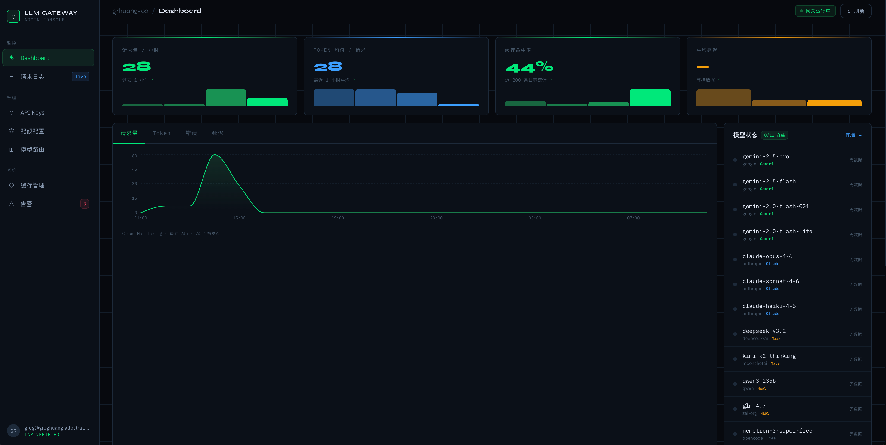

# LLM Gateway — Admin UI

A Next.js 15 management console for the LLM Gateway on Apigee X.
Provides real-time dashboard, API key management, token quota configuration, request logs, model routing, cache management, and alert policies.

Protected by Google Cloud IAP. Deployed on Cloud Run.



---

## Pages

| Page | Route | Description |
|------|-------|-------------|
| Dashboard | `/` | Request volume, token usage, cache hit rate, latency trends; model online status; recent activity log |
| API Keys | `/keys` | View / create / revoke Apps; token quota progress bars |
| Quota Config | `/quota` | Product-level and App-level token quotas; model cost weights (with auto-generate via Gemini) |
| Request Logs | `/logs` | Structured log viewer; filter by model, status, cache status; URL-driven pagination |
| Model Routing | `/models` | Read Apigee bundle + KVM + Cloud Logging; model routing status; inline PATCH updates |
| Cache Management | `/cache` | Cache hit rate statistics; dynamic similarity threshold configuration |
| Alert Policies | `/alerts` | Cloud Monitoring alert policies and notification channel management |

---

## Tech Stack

| Layer | Technology |
|-------|-----------|
| Framework | Next.js 15.2.3 (App Router) + React 19 |
| UI | shadcn/ui + Tailwind CSS — dark "command center" theme |
| Charts | Recharts |
| Auth | Cloud IAP (primary) + `lib/auth.ts` per-handler validation (defense-in-depth) |
| Data sources | Apigee Management API, Cloud Logging API, Cloud Monitoring API, Vertex AI |
| Runtime | Cloud Run (standalone output, non-root user) |

> **Security:** Next.js < 15.2.3 has CVE-2025-29927 middleware bypass. Pinned to `"next": "15.2.3"`.

---

## Local Development

```bash
cd ui
npm install
npm run dev     # http://localhost:3000 (Turbopack, hot reload)
```

IAP validation is automatically bypassed in development (`NODE_ENV=development`). No auth setup needed locally.

### Environment variables (optional for local dev)

```bash
# Copy and fill in for local testing against real GCP
export GOOGLE_CLOUD_PROJECT=your-project-id
export APIGEE_ORG=your-project-id
export CROSS_PROJECT_ID=your-cross-project-id   # optional, for cross-project routing
```

### Available commands

| Command | Description |
|---------|-------------|
| `npm run dev` | Start dev server (Turbopack, http://localhost:3000) |
| `npm run build` | Production build (Next.js standalone output) |
| `npm run start` | Start production server (requires build first) |
| `npm run lint` | ESLint check (eslint-config-next) |

---

## Deployment

See the [main README Phase 6](../README.md#phase-6--admin-ui-cloud-run--iap) for the full deployment walkthrough (Artifact Registry, Cloud Run, HTTPS LB, IAP).

Quick redeploy after code changes:

```bash
cd ui
docker build -t us-central1-docker.pkg.dev/YOUR_PROJECT_ID/llm-gateway/admin-ui:latest .
docker push us-central1-docker.pkg.dev/YOUR_PROJECT_ID/llm-gateway/admin-ui:latest
gcloud run deploy llm-gateway-ui \
  --image=us-central1-docker.pkg.dev/YOUR_PROJECT_ID/llm-gateway/admin-ui:latest \
  --region=us-central1 \
  --project=YOUR_PROJECT_ID \
  --no-allow-unauthenticated
```

---

## Directory Structure

```
ui/
├── app/
│   ├── layout.tsx                     # Global layout: Sidebar + IAP user header
│   ├── page.tsx                       # Dashboard (Server Component, force-dynamic)
│   ├── keys/page.tsx                  # API Key management
│   ├── quota/page.tsx                 # Quota configuration
│   ├── logs/page.tsx                  # Request logs (URL param filters + pagination)
│   ├── models/page.tsx                # Model routing status
│   ├── cache/page.tsx                 # Cache management
│   ├── alerts/page.tsx                # Alert policies
│   └── api/
│       ├── apps/route.ts              # POST: create App (auto-creates developer)
│       ├── keys/route.ts              # POST: revoke key / PATCH: update App attributes
│       ├── quota/route.ts             # POST: update Product quota (batch write, race-free)
│       ├── quota/app/route.ts         # POST: update App-level quota override
│       ├── weights/generate/route.ts  # POST: auto-generate model weights via Vertex AI
│       ├── models/route.ts            # PATCH: update model routing config via Apigee KVM
│       ├── cache/route.ts             # GET: cache stats / PATCH: update similarity threshold
│       └── alerts/route.ts            # GET/POST/PATCH/DELETE: alert policy management
├── components/
│   ├── layout/
│   │   ├── Sidebar.tsx                # Navigation sidebar
│   │   └── Topbar.tsx                 # Page header with gateway status indicator
│   ├── dashboard/
│   │   ├── MetricCard.tsx             # Numeric KPI card with trend
│   │   ├── RequestChart.tsx           # Time-series request/token chart (Recharts)
│   │   ├── ModelStatus.tsx            # Model online/offline status grid
│   │   └── ActivityFeed.tsx           # Recent request log feed
│   ├── keys/
│   │   └── KeyTable.tsx               # API key table with create/edit/revoke dialogs
│   ├── quota/
│   │   └── QuotaEditor.tsx            # Quota editor: Product / App / weight sections
│   ├── logs/
│   │   ├── LogTable.tsx               # Request log table
│   │   └── LogFilters.tsx             # Filter bar (model, status, cache, time range)
│   ├── models/
│   │   └── ModelGroupTable.tsx        # Model routing table with inline KVM editor
│   ├── cache/
│   │   ├── CacheStatsView.tsx         # Cache hit rate charts
│   │   └── CacheConfigPanel.tsx       # Similarity threshold configuration
│   ├── alerts/
│   │   └── AlertsList.tsx             # Alert policy list with enable/disable toggle
│   └── ui/                            # shadcn/ui primitives (button, dialog, table, etc.)
├── lib/
│   ├── auth.ts                        # IAP header validation (requireIAP)
│   ├── apigee.ts                      # Apigee Management API client
│   ├── logging.ts                     # Cloud Logging API client
│   ├── monitoring.ts                  # Cloud Monitoring API client (ALIGN_DELTA queries)
│   ├── model-routing.ts               # Parse model-router.js from Apigee bundle
│   ├── model-status.ts                # Model health: Cloud Logging success rate (past 1h)
│   ├── cache-stats.ts                 # Cache hit/miss stats from Cloud Logging
│   ├── alerts.ts                      # Cloud Monitoring alert policy operations
│   ├── alert-templates.ts             # Pre-defined alert policy templates
│   └── utils.ts                       # Shared utilities
├── Dockerfile                         # Standalone output; non-root user (nextjs:nodejs)
├── package.json                       # "next": "15.2.3"
└── next.config.ts                     # output: "standalone"
```

---

## Key Design Decisions

### Authentication (defense-in-depth)

```
Browser → Cloud LB (IAP enforced) → Cloud Run → lib/auth.ts → Route Handler
```

- **IAP is the primary layer** — unauthenticated requests are rejected at the GCP infrastructure level before reaching Cloud Run.
- **Every Route Handler independently validates** the `x-goog-authenticated-user-email` header via `requireIAP()`. Never relies on middleware alone (CVE-2025-29927 lesson).
- **Cloud Run ingress:** `internal-and-cloud-load-balancing` — direct `*.run.app` access is denied.
- **Local dev bypass:** When `NODE_ENV=development`, `requireIAP()` returns `dev@local` without checking headers.

### Data freshness

All pages use `export const revalidate = 0` (equivalent to `force-dynamic`) — Next.js ISR cache is disabled. Every page load fetches fresh data from GCP APIs.

| Data | Source | Notes |
|------|--------|-------|
| Request rate / token usage | Cloud Monitoring (`ALIGN_DELTA`) | Actual count per interval, not rate |
| Cache hit rate / latency | Cloud Logging (aggregated) | Derived from structured log entries |
| Model health | Cloud Logging success rate (past 1h) | ≥95% success = online |
| API keys / Apps | Apigee Management API | Real-time |
| Quota attributes | Apigee Management API | Real-time |

### Auto-generate model weights

The `/quota` page has a button to auto-generate token cost weights using Gemini:
- Calls `gemini-2.5-flash` with `thinkingConfig.thinkingBudget: 0` (disables thinking to avoid exhausting `maxOutputTokens`)
- Uses `responseMimeType: "application/json"` for strict JSON output
- Authenticates directly to Vertex AI using the Cloud Run service account (not through the Apigee gateway)

### Apigee attribute writes (batch, race-free)

All quota attribute updates use a single batch write:
```
GET  /apiproducts/{product}/attributes     → read all existing attributes
POST /apiproducts/{product}/attributes     → write merged attributes in one call
```
`PUT /apiproducts/{product}/attributes/{attr}` is not used — it returns 404 for new attributes and causes race conditions when called concurrently.

### Cloud Monitoring queries

`llm_request_count` and `llm_error_count` are `DELTA` metrics — queries use `ALIGN_DELTA` to get actual counts per interval (not `ALIGN_RATE`, which returns a per-second decimal).
`llm_token_usage` is a `DELTA + DISTRIBUTION` metric — use `ALIGN_DELTA` + extract `distributionValue.mean`.
